# Mod14-AlgoTrading_Bot 

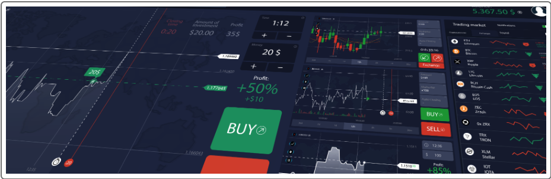 

*"Using a MachineLearning Algorithmic Trading Bot that adapts to new data and evolving markets."* 

## Background

This project creates an algorithmic trading bot that learns and adapts to new data and evolving markets for a financial advisory firm. Seeking to maintain an advantage over the competition, initiatives are taken to make improvements to the existing algorithmic trading system. The plan is to enhance the current trading signals by testing different classified machine learning (ML) algorithms in a Python notebook. By testing different classified MLs, performance can be compared to adaptation of new data under differing market environments. 

The FinTech technology in this program utilizes ScikitLearn ML algorithm software tools. The tools are used to build algorithmic models by adjusting inputs for buy, sell or hold signals; these signals are derived from a technical indicator called simple moving average(SMA). SMA's calculate the average stock prices over a rolling time period designating a number of days in time windows. 

Using the pandas rolling function with the `window` parameter the time can be specified and adjusted from days to minutes depending on your trading strategies. A short-window(usually 5, 10, 20 days) and long-window(usually 50, 100, 200 days) are often used to spot positive or negative price trends. When looking at a chart for example, the short window 20 day SMA crosses over the long-window 100 day SMA a trigger point to enter or exit a trade. These SMA crossover points known as dual-moving-average-crossover(DMAC) signal buys or sells by our models.  

Adjusting the ML algorithm inputs one can put together models, tune them, visualize performance on charts, and backtest them for evaluation on a Classification Report. Additionaly, other classes of ML models are available for backtesting and predicting outcomes before applying them to your strategies.  


---
## Evaluation Results

The following evaluation describes the performance test of the imported models, with the loss and accuracy metric scores of all algorithm machine learning models. To analyze and conclude each model’s performance it's Cumulative Returns chart is visualized and Classifier Report are evaluated. The first 4 models are baseline set at 3 month time with SMA short-window @4days and long-window @100days for initial comparison.

* 1) SVC Original Model: 
  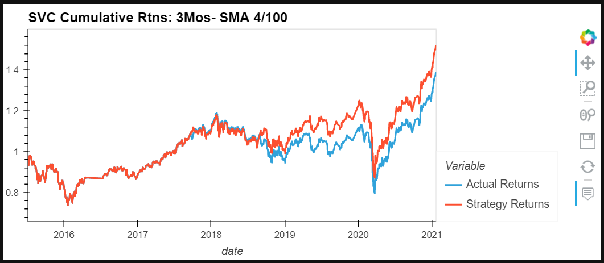  
  
* 2) LogisticRegression Model Results:
 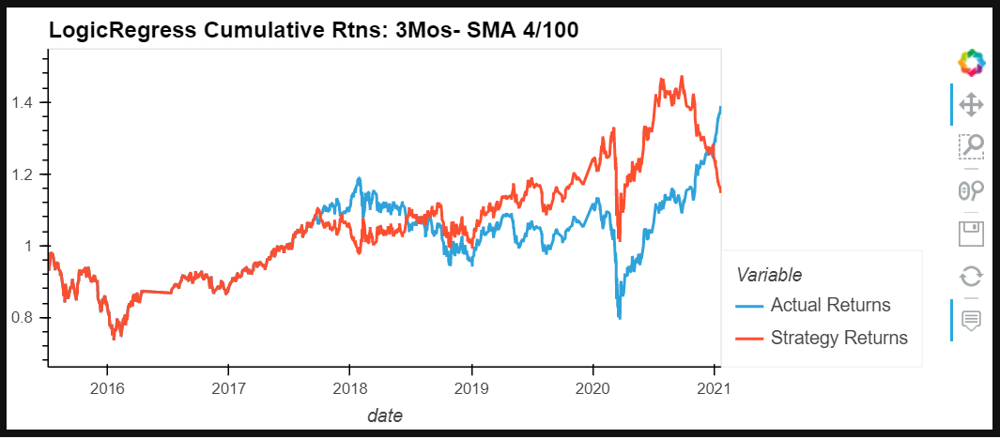

* 3) AdaBoostClassifier Model Results:
 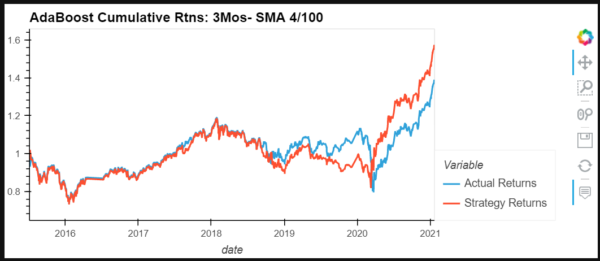

* 4) DecisionTreeClassifier Model Results:
 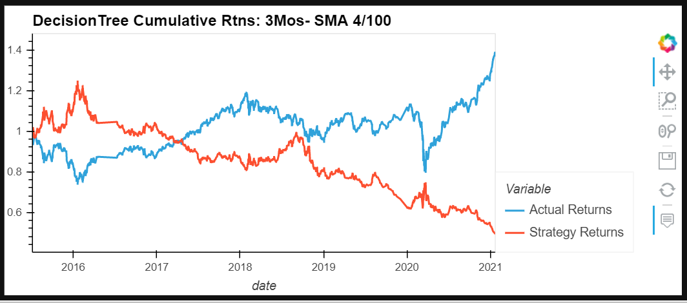 
 
 ### **Tune the Baseline Trading Algorithm**
 1. Tune the training algorithm by adjusting the size of the training dataset. To do so, slice your data into different periods. Rerun the notebook with the updated parameters. Answer the following question: What impact resulted from increasing or decreasing the training window? 
 With the adjustments for the `SVC` model from 3months,SMA 4/100 to 6M, SMA 4/100 showed outstanding improvement in results. The 6M,SMA 4/100 was the best performer posting cumulative returns of 1.841664 vs 1.5176 shorter 3 mos. time frame and besting 'Actual Returns' at 1.5604. 
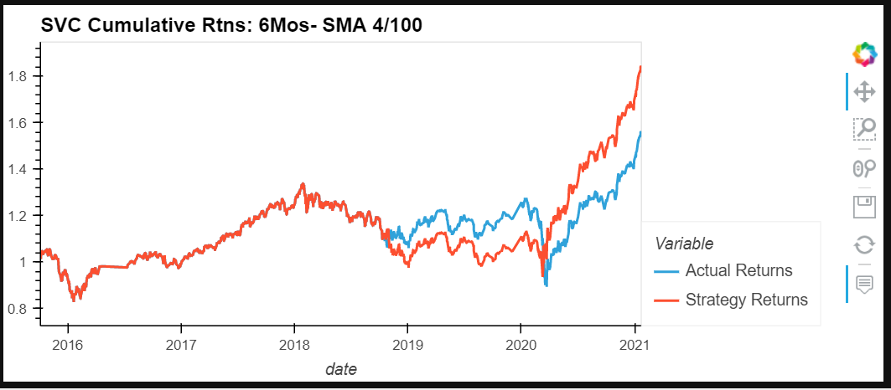   

 2. Tune the trading algorithm by adjusting the SMA input features. Adjust one or both of the windows for the algorithm. Rerun the notebook with the updated parameters. Answer the following question: What impact resulted from increasing or decreasing either or both of the SMA windows? 
With the adjustments for the `SVC` model from 3months,SMA 4/100 to 3M, SMA5/10; 6M, SMA 5/10; 6M, SMA10/50 their were noticable results. The 6M,SMA 4/100 was the best performer posting cumulative returns of 1.841664  vs the others at 1.2690; 1.3311; 1.6107, respectively. 

 3. Choose the set of parameters that best improved the trading algorithm returns. Save a PNG image of the cumulative product of the actual returns vs. the strategy returns. Answer the following question: What impact resulted from increasing or decreasing the training window?
 **Conclusion:**   The above `SVC` model with 6 month and SMA 4/100 DMAC results are the top performer yielding 1.841664 returns amoung the shorter 3 month window ML model. The chart is above in 2. and the return dta is below. 
 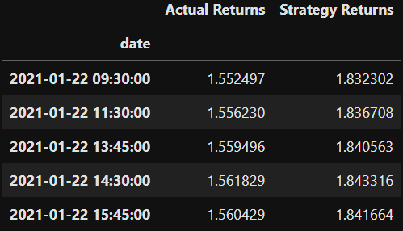 
 
 Surprisingly, the `SVC` 3 & 6 month model with SMA 5/10 & SMA 10/50 DMAC matched the 'Actual Returns' @ 1.269070 and 1.6107 respectively, for 4th best performers among the ML models across all parameters. The SVC model seemed to be the most consistent in performance returns overall with the 6mos, SMA 5/10 performing the worst with 1.3311 returns vs 'Actual Returns' of 1.4596. 

 ### **Evaluate a New Machine Learning Classifier** 
  All four models were adjusted and tuned using 3 & 6 month, and 1 year time periods with cooresponding SMA 4/100, 5/10, and 50/100 inputs which gave results from 96 adjustments. The year models were discarded for worst perfomance.  

 3. Backtest the new model to evaluate its performance. Save a PNG image of the cumulative product of the actual returns vs. the strategy returns for this updated trading algorithm, and write your conclusions. Answer the following questions: Did this new model perform better or worse than the provided baseline model? 
 Surprisingly, out of the four ML algorithm models tested the`AdaBoost` model with 3 month time period and SMA 4/100 yielded the 2nd best returns at 1.5708. 

 Did this new model perform better or worse than your tuned trading algorithm? 
No, but it brought respectable 2nd place results. The `AdaBoost` 6 mos, SMA4/100 cumulative returns of 1.4306 underperformed 'Actual Returns' and did not come to my expectations.
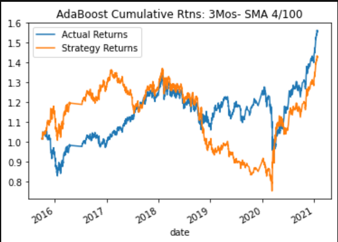 

Interestingly, `DecisionTreeClassifier` would make a good short sale trader algorithm ML trade bot as it was the worst performer diverging in bearish trends across all 4 adjustments. 

---

## Technologies

The software operates on python 3.9 with the installation package imports embedded with Anaconda3 installation. Pandas, NumPy, hvplot, Matplotlib and scikitlearn are libraries for imported tools this program uses to build the application to analyze stock prices and set decision signals of when to buy and sell shares.  The application tools that you need for this module to construct models to perform ML algorithms are `SVC`, `LogisticRegression`, `AdaBoostClassifier`, `DecisionTreeClassifier`.  Please reference the formerly named ML algorithm classifiers on the official web site [Supervised Learning for scikit ML Classifiers Install Guide](https://scikit-learn.org/stable/supervised_learning.html) installation and documentation.   


---

## Installation Guide

Before running the applications open your terminal to install and check for your installations. First navigate to scikit-learn.org for installation instructions using the link below. Then verify if the installation as been completed. 

* [python](https://www.python.org/downloads/)

* [anaconda3](https://docs.anaconda.com/anaconda/install/windows/e) 

* [scikitlearn](https://scikit-learn.org/stable/install.html) 

```python libraries
pip install -U scikit-learn
python -m pip show scikit-learn                      # to see which version of scikit-learn is installed
conda install numpy
```
```import pandas as pd
import numpy as np                                        # returns conditional classification values for signals
from pathlib import Path
import hvplot.pandas                                       # for chart visualations
import matplotlib.pyplot as plt
from sklearn import svm                                    # algorithm ML model
from sklearn.preprocessing import StandardScaler           # standardizes data for models 
from pandas.tseries.offsets import DateOffset              # allows length of time adjustments
from sklearn.metrics import classification_report          # renders 
from sklearn.linear_model import LogisticRegression        # algorithm ML model
from sklearn.ensemble import AdaBoostClassifier            # algorithm ML model
from sklearn.tree import DecisionTreeClassifier            # algorithm ML model
```

---
# Usage

This application is launched from web-based Jupyter notebook utilizing Pandas and scikitlearn `StandardScaler` to preprocess data for categorical variables in the ML algorithm model computations. Scikit ML models are tunable by adjusting input features to find parameters that result in the best outcomes for different trading strategies and adapt to market environments. While `classification_report` illustrates the evaluation metrics such as accuracy, precision and recall.    

The program is developed in Jupyter notebook on a jupyter **.ipny** file. The Python library makes it possible to utilize pandas, numpy and pathlib to build this ML algorithm. The design applies the model-fit-predict process to make a binary classification of whether a startup is successful or not.
 

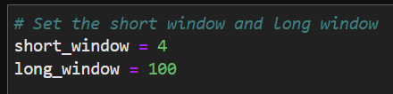
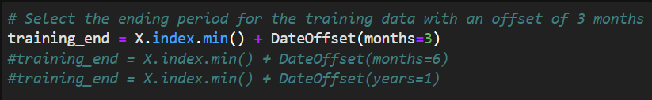 
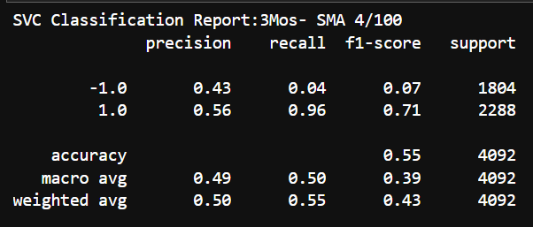 


```python
machine_learning_trading_bot.ipynb
```
 

---

## Contributors

*Provided to you by digi-Borg FinTek*, 
Dana Hayes: nydane1@gmail.com

---

## License

digi-Borg/M18-Blockchain_Ledger is licensed under the

[BSD 2-Clause "Simplified" License]()
A permissive license that comes in two variants, the BSD 2-Clause and BSD 3-Clause. Both have very minute differences to the MIT license.